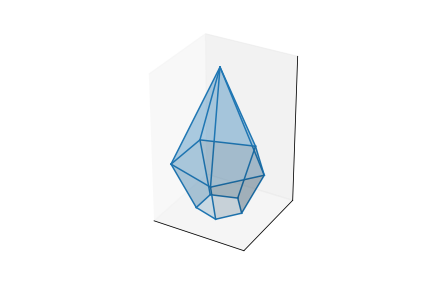

# Himmeli
Plot Himmeli in 3D &amp; 2D to create  mobiles. 

## Usage

```
him = Cone(60, 80, 3, folder=Path("Himmeli"))

fig, ax = plt.subplots(subplot_kw=dict(projection="3d"))
him.plot(ax)
if save:
    plt.savefig(him.file_3d)
plt.show()

fig, ax = him.plot_paper()
if save:
    plt.savefig(him.file_2d)
plt.show()
```


```
him = Bicone(45, 30, 35, 5, folder=Path("Himmeli"))

fig, ax = plt.subplots(subplot_kw=dict(projection="3d"))
him.plot(ax)
if save:
    plt.savefig(him.file_3d)
plt.show()

fig, ax = him.plot_paper()
if save:
    plt.savefig(him.file_2d)
plt.show()
```


```
him = Bicone_Lack(60, 30, 60, 20, 4, folder=Path("Himmeli"))

fig, ax = plt.subplots(subplot_kw=dict(projection="3d"))
him.plot(ax)
if save:
    plt.savefig(him.file_3d)
plt.show()

fig, ax = him.plot_paper()
if save:
    plt.savefig(him.file_2d)
plt.show()
```


