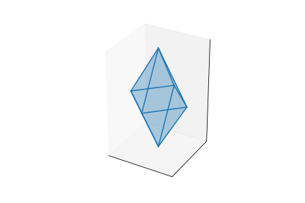

# Himmeli
Plot Himmeli in 3D &amp; 2D to create  mobiles. 

## Usage

```
import matplotlib.pyplot as plt
from Himmeli import Cone, Bicone, Bicone_Lack

him = Cone(4, 4, 3)

ax = plt.figure().add_subplot(projection='3d')
him.plot(ax)
plt.savefig("Cone-3D.png")
plt.show()

ax = plt.figure().add_subplot()
him.plot_expansion(ax)
plt.savefig("Cone-2D.png")
plt.show()
```


```
him = Bicone(4, 3, 4)

ax = plt.figure().add_subplot(projection='3d')
him.plot(ax)
plt.savefig("Bicone-3D.png")
plt.show()

ax = plt.figure().add_subplot()
him.plot_expansion(ax)
plt.savefig("Bicone-2D.png")
plt.show()
```




```
him = Bicone_Lack(4, 2, 1, 5)

ax = plt.figure().add_subplot(projection='3d')
him.plot(ax)
plt.savefig("Bicone_Lack-3D.png")
plt.show()

ax = plt.figure().add_subplot()
him.plot_expansion(ax)
plt.savefig("Bicone_Lack-2D.png")
plt.show()
```


